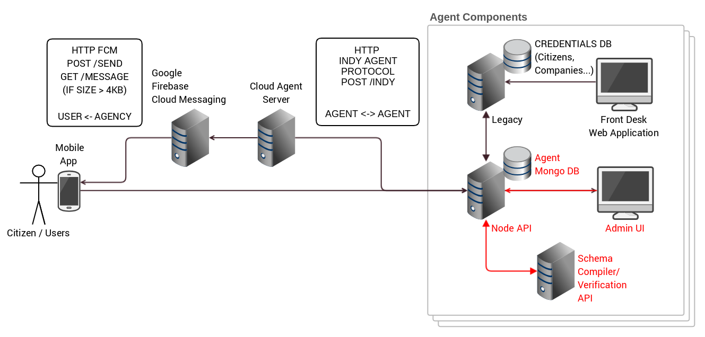
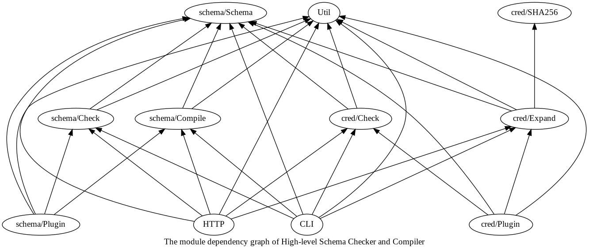
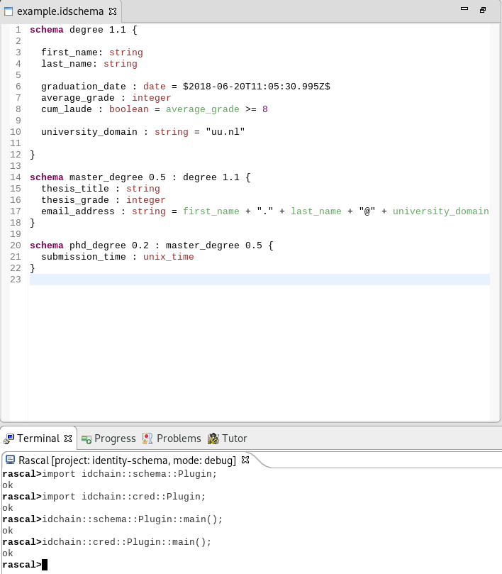
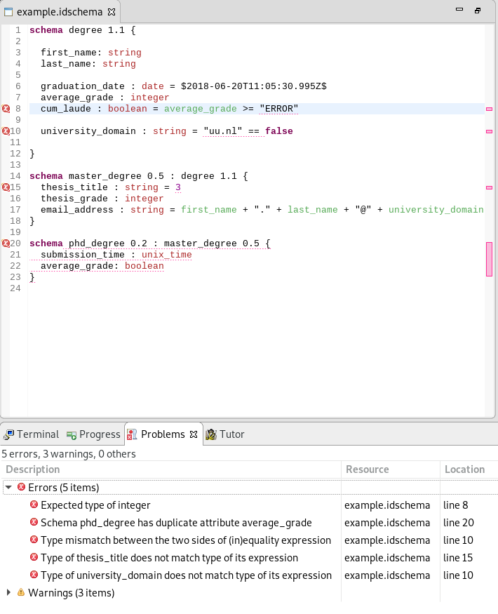
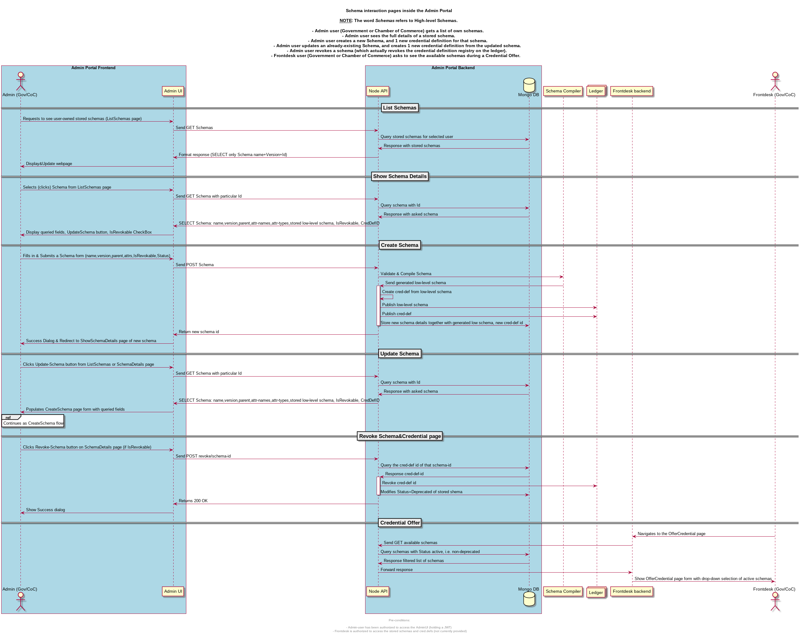

% author Nikolaos Bezirgiannis
% date 22/10/2018
% title Manual of High-level Schemas and Credentials

# Introduction

The [Indy open-source project](https://sovrin.org/developers/)
has introduced the concepts of Credentials and Schemas to be used in conjunction with their distributed-ledger offer for self-sovereign digital identities.

An Indy Credential (also known as "Claim") is issued by an Issuer and handed to
the Holder to hold in his/her wallet. An Indy Credential is comprised of a set of attribute names
together with values for those attribute names, filled in at creation-time by the issuer.

An Indy schema can be seen as a template to credentials, and it takes the form of a list of attribute names.

Each published Indy schema is uniquely-identified and stored on the Indy ledger for others to access.
The concept of Schemas can be easily justified by the need for standardization (or wider consensus) on what each
credential's attribute actually means or represents.
For example, a credential attribute name "Full Name" can possibly be given
separate, incompatible interpretations: first name followed by last name, or last name then first name, or names separated by a comma, etc..
If different parties of the Indy platform (issuers, holders, verifiers) all use and refer to the same schema in their transactions (e.g. a "Passport" schema), 
then there is an implied common agreement on the meaning of every attribute name inside that schema.h
Overall, we can say that an Indy schema provides the means for "standardizing" the internal format (attribute names) of new credentials.


Although an Indy Schema can be created by any verified Indy user (i.e. trust anchor),
schemas add tremendous value only when they are widely-accepted and recognized (i.e. more than a handful of parties).
So the chance of accepting and using a particular Schema may be linked on the popularity or power of the schema-creator's identity
(e.g. a government, a bank, a standardization group).
For example, a schema "FooBar Member" created by a local bar in the neighbourhood named "Foo Bar" to issue new memberships,
will have far less applicability compared to some government's "National ID", which subsequently has less applicability
than a schema "Passport" created by the International Civil Aviation Organization (ICAO).


The Indy schemas have a very low-level (simple) format; they are comprised just of:

- a name (e.g. "Passport", "BankAccount") 
- a version (e.g. "0.3", "1.5")
- a list of attribute names (e.g. ["first_name", "last_name", "fullname", "birthdate", "nationality"])

## Motivation

When examining the concept of Schemas as defined by the Indy project we observe
a number of shortcomings namely:

a) An Indy schema does not declare types for its values, e.g. is the value to this attribute supposed to be an ISO date or just a string?

b) A schema cannot re-use attributes of another already-existing schema (schema inheritance).

c) An Indy credential always refers to a single Indy schema and has to "fill-in" the values of all the schema's attributes. However,
certain attributes could be in a sense derived; for example, a "fullname" can be defined as the juxtaposition of the "first_name" and the "last_name".
Furthermore, the values of these credential attributes as defined by Indy cannot be type-checked, since the Indy schemas are untyped to begin with.


[//]: # "The Indy schemas are immutable (stored on the ledger), and if they need to be evolved, a new schema with a different version has to be created. Indy does not do any check that the version is monotonically increasing."

The rest of this deliverable describes our work, in the context of the EITDigital "IdentityChain" project,
to extend the Indy Schemas and Credential with a) types and b) schema inheritance and c) derived credentials, both in a **backwards-compatible** manner to the current Indy (low-level) schemas and
Indy tools (`indy-sdk`, ledger, etc.). For this reason we

- define a statically-typed domain-specific language to write "higher-level" schemas than Indy schemas (Chapter 3)
- provide a typechecker to check the consistency of these high-level schemas (Section 3.4)
- provide a compiler to generate low-level Indy schemas from these high-level schemas for supportin backwards-compatibility and interoperability with the Indy ledger (Section 3.5)
- compute and derive values for partially-filled Indy credentials (Chapter 4).

# Overview

The typechecker & compiler of the high-level schema language that we describe in this document connects and interacts
with other components of the IdentityChain EITDigital project, namely:

- The general IdentityChain Client API, written in NodeJS and described in Deliverable "DEL02: Client and Interface to Identity Blockchain"
- The Admin User Interface (AdminUI for short), described in this deliverable's section over [Integration with the IDChain Admin-UI].


The next figure contains a "bird's-eye view" of the all the components of the IdentityChain system.



Highlighted in red is, first, the schema-compiler component (served through an API endpoint) and its:

- direct connection to the Client (Node) API
- indirect interaction with the MongoDB client store
- indirect integration with the AdminUI portal

The connection of the Client Node API to the Schema-compiler API acts mostly as a reverse proxy for forwarding the requests
and responses of the client concerning high-level schemas, but with two added benefits:

1) the user/client authentication provided by the Node API
2) the persistence of high-level schemas (creation,update,deletion), achieved through the already-existing client store (MongoDB)

Consequently, the Admin User Interface (AdminUI Portal) makes use of this secure API and database to visually assist the user in operating
over high-level schemas.

# The high-level schema language

In this section, we introduce the syntax and the types of our new high-level schema language targetting Hyperledger Indy.
The section contains also some examples for the user to understand what is possible to define with these high-level schemas.
We also provide the literal high-level schemas that were used during the IDChain project's demo, and how they are compiled
to the present (low-level) Indy schemas.

## Declaration of Schemas

A single high-level schema is defined with the syntax :

```
schema Name Version ParentName? ParentVersion? {
   Attributes....
}
```

`Name` and `Version` refer to the schema about-to-be defined, with its attributes following inside the curly brackets.
`ParentName` and `ParentVersion` are optional and refer to a single, specific parent schema to inherit its attributes from.

If a parent schema is declared, all the attributes of the parent schema and its ancestors are included in the currently-defined schema.
Any inherited attributes cannot be overridden, but can be refer to in `AttrExpr`s (see below on Expressions).

The `Name` and `ParentName` are case-sensitive identifiers to Schema, and follow the syntax of C variable names:

> A schema-name can have non-Unicode letters (both uppercase and lowercase letters, case-sensitive), digits and underscores only.
> The first letter of a schema-name should be either a letter or an underscore. 

([link about C variable naming](https://www.programiz.com/c-programming/c-variables-constants))

The `Version` and `ParentVersion` syntax has a major code and a minor code (separated by a dot `.`),
e.g. `0.0`, `0.1`, `0.100000`, `00003.14`. The major and minor code can contain any number of digits. Both major and minor codes are required.
Although this coding scheme looks like a "floating-point number", the language does not treat codes semantically as floating-point values,
but only compares them lexicographically, (e.g. schema version `1.0` is different than version `1.0` and `0001.0000`).

## Declaration of Attributes

A high-level schema attribute is defined as:

```
  AttributeName : AttributeType = AttributeExpr?
```

An `AttributeName` does not follow the same naming pattern as schema-names (and c variables).
This is by design so that the attribute names are compatible with the attribute names inside the low-level Indy schemas.
In Indy attributes are case-insensitive and for that reason, we allow only lower-case
non-Unicode letters, digits and underscores only.
The first letter of an attribute-name should be either a letter or an underscore.


The `AttributeType` is fixed and can only be one of `boolean`, `integer`, `string`, `date`, `unix_time`, `inverted_unix_time`.

- The `boolean` type encompasses the logical `true` and `false`.
- The `integer` type is for arbitrary-precision decimal integrals (i.e. base-10 integers, like Java's `Integer` class).
- The `string` is for any unicode text surrounded by the double-quote symbol `"`. 
  To escape the double-quote symbol inside the string use a backslash `\"`.
  To escape the backslash symbol inside the string use a double backslash `\\`
- The `date` is a datetime string formatted according to [ISO8601 international standard](https://en.wikipedia.org/wiki/ISO_8601).
- The `unix_time` is an arbitrary-precision integer, which points to a particular time (seconds) passed since the unix epoch (1/1/1970). 
- The `inverted_unix_time` is an arbitrary-precision integer, which points to a particular time (seconds) that comes before the unix epoch (1/1/1970).
Note: this is needed for Zero-Knowledge proofs (ZKP).

Attributes are separated by whitespace or newline characters, e.g:


```
schema S 0.1 {
  attr1 : type1 attr2 : type2 = expr2
attr3 : type3
}
```

## Expressions

An attribute inside a high-level schema can optionally be followed by the equals sign `=` together with an expression `AttrExpr`. 
This attribute then is called a "derived attribute", because its value is not user-inputted when filling-in a credential, but
automatically-derived by evaluating the expression in a specific context (for more about this, see the section on High-level Credentials).

An expression can be 

1. an attribute name (defined in the current schema or any ancestor schema)
1. a string, surrounded in double quotes, e.g. `"text"`
1. a date literal in ISO 8601 format, surrounded in `$` marks, e.g. `$2018-06-20T11:05:30.997+00:00$`  , `$2018-06-20T11:05:30.996Z$`
1. a date represented in UNIX time, which is the seconds since 1/1/1970 or before 1/1/1970 (inverted_unix_time) surrounded in `|` marks, e.g. `|838383838381843491|`  , `|3|`
1. a decimal integral number, e.g. `0`, `-273`, `1337`
1. constants `true` and `false`
1. binary arithmetic operators of expressions, `+ * / -`
1. comparators `== != < > >= <=`
1. boolean-logic operators `&& || not`
1. parenthesized expression, for overriding precedence, e.g. `(1+3)*4`

## The type system of the schema language

The high-level schemas are statically typed with strong typing and single inheritance.

A high-level schema must pass the syntax checker (with 0 errors)
before it is checked for its type correctness.

### Types of literals

- `true` : boolean
- `false` : boolean
- `...-2,-1,0,1,2,3...1` : integer   (a base-10 arbitrary-precision integer)
- `"text"` : string
- `$2018-06-20T11:05:30.997+00:00$` : date
- `|344|` : unix_time or inverted_unix_time

### Types of Operators

- `+` , `-`, `*`, `/` : (integer,integer) -> integer
- `+` : (string,string) -> string (string concatenation)
- `+` : (unix_time,unix_time) -> unix_time
- `==`, `!=` : (a,a) -> boolean
- `not` : boolean -> boolean
- `&&`, `||` : (boolean, boolean) -> boolean
- `< > >= <=` : (integer, integer) -> boolean
- `< > >= <=` : (date, date) -> boolean
- `< > >= <=` : (unix_time, unix_time) -> boolean

[//]: # "- `< > >= <=` : (inverted_unix_time, inverted_unix_time) -> boolean"

## Compiling to low-level Indy schemas

A high-level schema must be type-correct (pass the syntax & typechecker with 0 errors),
before it is compiled down to low-level Indy schemas.

The compilation process is summarized as follows:

- Inherited attributes of ancestor schemas are textually included in the schema to be currently compiled.
- All the attribute expressions `AttrExpr` are stripped-off in the Indy schemas.
- The attribute type `AttrType` is packed inside the attribute name string of the low-level indy schema, e.g. (`"first_name@string"`, `"grade@integer"`).

Note that the compiler automatically checks for cycles in the inheritance chain of all high-level schemas and stops with an error.

## An example of high-level schemas

We try to compile the following high-level schemas (from inside a single file):

```
schema degree 1.1 {

  first_name: string
  last_name: string

  graduation_date : date
  average_grade : integer
  cum_laude : boolean = average_grade >= 8

  university_domain : string = "uu.nl"

}

schema master_degree 0.5 : degree 1.1 {

  master_thesis_title : string
  master_thesis_grade : integer

  email_address : string = first_name + "." + last_name + "@" + university_domain
}
```

The generated low-level schemas by the compiler are the two schemas:

```
{"attr_names": ["first_name@string","last_name@string","graduation_date@date", "average_grade@integer", "cum_laude@boolean","university_domain@string"],
"version": "1.1",
"name": "degree"}
```

```
{"attr_names": ["first_name@string","last_name@string","graduation_date@date", "average_grade@integer", "cum_laude@boolean","university_domain@string", "master_thesis_title@string", "master_thesis_grade@integer"],
"version": "0.5",
"name": "master_degree"}
```

## Schemas to be used in the IDC Project Demo


### Government Schema

Its high-level representation:

```
schema passport 1.0 {
    credential_offered: unix_time
    social_security_number: integer
    document_number: integer
    surname: string
    given_name: string
    gender: string
    nationality_code: string
    birth_date: unix_time
    birth_place: string
    authority: string
    date_of_issue: unix_time
    date_of_expiry: unix_time

}
```

And how it is compiled to low-level Indy schema by the Schema compiler:

```json
{"attr_names": ["issuance_time@unix_time","credential_offered@unix_time","social_security_number@integer","document_number@integer","surname@string","given_name@string","gender@string","nationality_code@string","birth_date@unix_time","birth_place@string","authority@string","date_of_issue@unix_time","date_of_expiry@unix_time"],
"version": "1.0",
"name": "passport"}
```


### Chamber of Commerce Schema

Its high-level representation:

```
schema company 1.0 {
    credential_offered: unix_time
    chamber_commerce_number: integer
    legal_name: string
    street_address: string
    address_locality: string
    postal_code: string
    establishment_number: integer
    registration_date: unix_time
    last_ownership_verification: unix_time
    owner_name: string
    owner_social_security_number: integer
}
```


And how it is compiled to low-level Indy schema by the Schema compiler:


```json
{"attr_names": ["issuance_time@unix_time","credential_offered@unix_time","chamber_commerce_number@integer","legal_name@string","street_address@string","address_locality@string","postal_code@string","establishment_number@integer","registration_date@unix_time","last_ownership_verification@unix_time","owner_name@string","owner_social_security_number@integer"],
"version": "1.0",
"name": "company"}
```
## Limitations of high-level schemas

- High-level schema-names and attribute-names do not accept unicode characters (by design); on the other hand, derived values of string type can be unicode.
- The user is not allowed to extend the type system with new types.
- Similarly, the user-defined high-level schemas cannot appear as types themselves (i.e. schemas as datatypes).
- There is no module system and no namespaces. The schemas are inputted in a single file when using the CLI (see "Using the schema compiler" section) or
stored/queried from a common table/view of a database (MongoDB in the case of `admin-ui` and `api` projects).
- There is currently no semantic versioning of high-level schemas. This would also require some changes to the schema-version syntax.
- To avoid confusion we disallow for now the "self-inheritance" of schemas, e.g. `schema S 0.2 S 0.1 { ... }`, which would otherwise
mean the backwards-compatible extension (evolution) of a schema. This self-inheritance is disallowed in any level of ancestorship (S is parent, grandparent, etc.)


# Issuing credentials from high-level schemas


When using Indy credentials together with high-level schemas, you
get the benefit of

1. typechecking the values of your inputted credentials compared to the referred high-level schema
2. automatic evaluation of all the derived-attributes of the referred high-level schema

The syntax of the credentials remains the same as it was in Indy, which is a JSON structure.

An Indy credential is a JSON object, as seen in the following example:

```
{ "schema_id":"someDid:MSc:0.5"
, "values": {"firstName": {"raw": "hello", "encoded": "SHA_A"}, 
         "lastName: {"raw": "world", "encoded": "SHA_B"}, 
        ...
       "issuance_time": {"raw": "124325413515", "encoded": "SHA_C"}
        }
...
}
```

The `schema_id` is parsed to extract the schema-name and schema-version that this credential points to. Then this information is used
to find the high-level schema in a given collection of available high-level schemas (given as a file or database to the compiler over CLI/HTTP).

Each attribute in the credential has a name (e.g. "firstName"), an accompanied value ("raw"), and the "encoded" digest of the raw value (hashed using SHA256).

## Assumptions about the inputted credentials

The inputted credential will be checked to see if the "raw" values of its attributes correspond with the expected type of the high-level schema.

Since the "raw" values are given just as "strings" (according to Indy specification documentation), we cannot know the intended type interpretation of the raw value. 
For this reason, we use the following procedure:

- If the expected-type of that attribute is `integer`. we try to parse its value as a decimal integral number.
- If the expected-type of that attribute is `unix_time` or `inverted_unix_time`. we try to parse its value as a decimal integral number (seconds since/before UNIX epoch 1/1/1970).
- If the expected-type is `boolean`, we try to parse it as the boolean values `true` or `false`.
- If the expected-type is `date`, we try to parse the value according to ISO 8601 format.
- If the expected-type is `string`, we always accept the value as type-correct, even it is e.g. "123", "false", "true".

In other words, if the expected type is a `string`, we always succeed with accepting the type of the inputted value. This is a necessary evil, since
inputted Indy credentials are completely untyped (raw values are always JSON strings).

The typechecker expects that all inputted credentials to-be checked come with a `issuance_time` attribute with its value expected to be of type `unix_time`.
This `issuance_time` attribute is an implicit, hidden attribute which does not have to be declared inside a high-level schema.

NB: The meaning of `issuance_time` refers only to the unix epoch time where the issuer acknowledges that the credential came to existence, and it does not
say anything about its validity/expiration time.

## Compiling to low-level credentials

The compiler expects an inputted credential that passes the above type-checker, i.e. the credential conforms to the specified high-level schema.
If indeed the credential is type-correct, the compiler will evaluate the "raw" values of the derived-attributes of its schema (and its ancestor schemas) 
and also compute the "encoded" value for those derived-attributes.

Note that the compiler does not check nor re-generate the encoded attributes of non-derived inputted attributes. This is supposedly already-done by the `indy-sdk`.

The resulting credential is a "complete" low-level credential, which can by passed back to the `indy-sdk` to be "handed" through the issuer's agent to the Credential Holder 
(user).

The compiler will complain with an error in the cases of:

1. missing required attributes, i.e. attributes that are expected by the high-level schema and its ancestors but not provided by the inputted credential.
1. extraneous attributes, i.e. attributes that appear in the credential but not on the corresponding high-level schema and its ancestors.
1. credential attributes that try to override the derived-attributes of the high-level schema.


## An example of issuing credentials via high-level schemas

Here, we try to issue a credential that will refer to the [Example Schema](#an-example-of-high-level-schemas) earlier in this document.
To do this, we construct a "template" json credential, with the required attributes of the schema manually filled in (e.g. "issuance_time", etc):


```json
{"schema_id":"4cU41vWW82ArfxJxHkzXPG:2:master_degree:0.5"
,"values":{ 
       "issuance_time@unix_time": {"raw": "123", "encoded": "0"},
       "first_name@string": {"raw": "hello", "encoded": "456"}, 
       "last_name@string": {"raw": "world", "encoded": "3"}, 
       "graduation_date@date": {"raw": "2018-06-20T11:05:30.995Z", "encoded": "5"},
       "average_grade@integer": {"raw": "3", "encoded": "0"},
       "master_thesis_title@string": {"raw": "title", "encoded": "123"},
       "master_thesis_grade@integer": {"raw": "4", "encoded": "123"}
      }
}
```

Given this file as input, our compiler will typecheck the credential according to its referred schema (in this case `master_degree`, version `0.5`),
and if it passes the typechecking, will then compute the derived attributes and their values and will produce as output a final JSON credential:


```json
{
  "schema_id": "4cU41vWW82ArfxJxHkzXPG:2:master_degree:0.5",
  "values": {
    "graduation_date@date": {
      "encoded": "5",
      "raw": "2018-06-20T11:05:30.995Z"
    },
    "master_thesis_title@string": {
      "encoded": "123",
      "raw": "title"
    },
    "master_thesis_grade@integer": {
      "encoded": "123",
      "raw": "4"
    },
    "last_name@string": {
      "encoded": "3",
      "raw": "world"
    },
    "university_domain@string": {
      "encoded": "31654418119683726840756750362558315911498404175950185525290167794809753237953",
      "raw": "uu.nl"
    },
    "first_name@string": {
      "encoded": "456",
      "raw": "hello"
    },
    "issuance_time@unix_time": {
      "encoded": "0",
      "raw": "123"
    },
    "average_grade@integer": {
      "encoded": "0",
      "raw": "3"
    },
    "cum_laude@boolean": {
      "encoded": "1",
      "raw": "false"
    },
    "email_address@string": {
      "encoded": "-32307617434142830464947546235834117769009426973317860678374494359833526045284",
      "raw": "hello.world@uu.nl"
    }
  }
}
```

Note that the compiler also computes the "encoded" values for each derived attribute.
The final JSON credential returned by the compiler, can subsequently be inputted to the Indy SDK to be **sent** to the eventual holder of this credential.


## Limitations of issuing credentials via high-level schemas

- Our compiler checks for the presence of `schema_id` and `values` in the inputted credential; the rest of fields of the credential (`signature`, `cred_def_id`,...)
are not (format) checked but ignored.


# Source-code structure of the high-level schema checker&compiler

The implementation of the schema checker&compiler sits under the `src/` directory
inside the github repository for the schema language.

The schema checker&compiler is mostly written in [Rascal](https://rascal-mpl.org), which is
a general meta-programming language to specify and develop domain-specific languages and the tools
around those languages. Such a domain-specific language is the high-level schema language presented in this documents,
since it caters to specific users (mainly Indy sovereign-identity users).

What follows is tree of the `src` folder, together with its containing source-code modules and their brief summary.

```
src/
└── idchain/
    ├── Util  * Contains general functions not found in standard Library of Rascal
    ├── schema/
    │   ├── Schema  * Contains the syntax of the  high-level schema language
    │   ├── Check  * Contains the logic for typechecking high-level schemas
    │   ├── Compile  * The compiler of high-level schemas to low-level Indy schemas
    │   └── Plugin  * An Eclipse IDE plugin to create interactively high-level schemas
    ├── cred/
    │   ├── Check  * For typechecking credentials against their high-level schemas
    │   ├── Expand  * For filling-in the derived attributes of the partial credentials
    │   ├── SHA256  * A helper module written in Java, needed by the Expand to compute SHA hashes of values
    │   └── Plugin  * An Eclipse IDE plugin to create interactively credentials
    ├── CLI  * A main-entry point executable to use the schema compiler fro the command-line
    └── HTTP  * Implements an HTTP server and an API to use the schema compiler through the web
```

Next is a visualized **module-dependendency graph** of the above source-code files.



# Building the schema checker&compiler

## For UNIX system

### Getting prerequisites

Before building the schema compiler, some external program dependencies have to be installed in the system.
Some UNIX distributions come pre-installed with the mentioned-below dependencies
or at least provide an easy way through their own package management service to install them.
Here we list those dependencies and where to download them:

1. A recent Java Development Kit (JDK) with version >= 7, for example OpenJDK version 8 at <https://jdk.java.net/8/>

2. The GNU Make build automation software, which can be manually downloaded, built and installed from <http://ftp.gnu.org/gnu/make/>

The first time you clone the schema compiler's Github repository, you can run inside the cloned directory:

```sh
make update
make
```

These two command will fetch any required libraries (e.g. Rascal) and build the schema compiler.
The resulting schema compiler "executable" file will be placed at the current path under `bin/idchain.jar`.

### (Optional) Rebuilding for UNIX

After a latest `git pull` of this repo, run:

```sh
make
```

The `bin/idchain.jar` "executable" file will be update in place. 

## For Docker

You need the `Docker` software to be already installed before you can build the schema compiler.
It is relatively easy to install Docker for most Linux distributions --- see your specific package manager for details.
For Windows and Mac systems,
you can download and run the "Docker Desktop" installer at <https://www.docker.com/products/docker-desktop>;
note that the installer may require special and fairly recent versions of the OS you are running,

Assuming Docker is installed and its service is up and **running**, you can clone the Github repository of the schema compiler and run inside its directory:

```sh
docker build -t idchain/schemacompiler .
```

To verify that the schema-compiler has successfully been built you can run afterwards:

```sh
docker image ls | grep idchain/schemacompiler
```

## (Optional) Rebuilding for Docker

Simply re-run inside the repository's directory:

```sh
docker build -t idchain/schemacompiler .
```

# Installing the schema checker&compiler

## (Optional) For UNIX system

If you are considering to place the schema-compiler in a real deployment, it
is is better to install it system-wide. To do this you have to append
to the `~/.profile` file the update to the java classpath:

```sh
export CLASSPATH=/home/bezirg/repos/schema-api/bin/idchain.jar:$CLASSPATH
```

Otherwise, you can use the locally-installed jar "executable" file directly.


## For Docker

From the image built before, you create a container for this image by running:

```sh
docker create --name schemac idchain/schemacompiler
```

The container is not yet started. To verify that the container has been created, run:

```sh
docker container ls -a | grep schemac
```

# Using the schema compiler

The schema-compiler can be used in different ways:

a) directly through the command-line (when installed for UNIX or Docker methods)
b) in the Eclipse software development platform (IDE) which allows interactive
visual feedback from the schema typechecker and compiler.
c) deployed as a web server. Multiple user clients can then ask the schema server
for typechecking and compiling high-level schemas; the server will return 
back to every client the results of the  schema compilation or 
any typechecking errors.

## In the command-line (UNIX installation)

Inside a terminal console, navigate to the schema-compiler's folder
(git cloned repository) and execute:


```sh
java -jar bin/idchain.jar idchain/CLI --help
```

Or if you placed the schema-compiler executable system-wide (inside the CLASSPATH) you can run in a terminal inside any folder:

```sh
java org.rascalmpl.shell.RascalShell idchain/CLI --help
```

The above commands will show a help-message output to the terminal screen, containing all the commands/parameters the user can pass to the schema-compiler through the command-line interface. An example of this help message follows:


```
Typechecker & Compiler of High-level Schemas/Credentials to low-level Indy schemas/credentials

--help                      (this message)
--schema <filepath>         The inputted file containing the higher-level schema(s)
--cred <filepath>           The inputted file containing the unfinished credentials given by the issuer
--checkSchema               Syntax-check and type-check the inputted schema
--checkCred                 Syntax-check and type-check the inputted credential
--compileSchema             Compile the inputted higher-level schema(s) to (lower-level) Indy schemas
--compileCred               Compile the unfinished inputted credential to a full Indy credential
--odir <directory>          Where to put the output files (default: current directory)
```

As an example, to typecheck and compile a schema, the user can call:

```sh
java -jar bin/idchain.jar idchain/CLI --schema SCHEMA_FILE --checkSchema --compileSchema
```

Or for issuing credentials via high-level schema, the user can call:

```sh
java -jar bin/idchain.jar idchain/CLI --schema SCHEMA_FILE --cred CREDENTIAL_FILE --checkCred --compileCred
```

## In the command-line (Docker installation)

Assuming Docker service is running and the Docker image and container of the schema-compiler has been installed, you can run:

```sh
docker start schemac
docker exec schemac java -jar bin/idchain.jar idchain/CLI --help
```

The above commands will start and print the help-message of the schema-compiler.
In order to typecheck&compile high-level schemas, the docker must be already started and the files containing the schemas and credentials must be transferred to the container before calling the schema-compiler. As an example,
we transfer a file containing schemas and a file containing and subsequently typecheck&compile those:

```sh
docker cp src/idchain/schema/example.idschema  schemac:/
docker cp src/idchain/cred/example.cred_json  schemac:/
```

And then to execute the schema-compiler for those transferred files:

```sh
docker exec schemac java -jar bin/idchain.jar idchain/CLI --schema /example.idschema --checkSchema --compileSchema
docker exec schemac java -jar bin/idchain.jar idchain/CLI --schema /example.idschema --cred /example.cred_json --checkCred --compileCred
```

The output files of the schema compiler can be copied back using again the `docker cp` command.


## In the Eclipse platform

The schema-compiler can also be executed inside the Eclipse platform.
For this you need to have installed a recent version of the Eclipse platform distribution for the RCP and RAP developers (e.g. <https://www.eclipse.org/downloads/packages/release/2018-09/r/eclipse-ide-rcp-and-rap-developers>),
and the Rascal eclipse plugin by using the Eclipse update site: `https://update.rascal-mpl.org/unstable/`


You can then import the cloned repository of the schema compiler by
simply navigating inside Eclipse to `File > Open Projects from File System...`
To load the interactive schema-compiler, start a Rascal Console by `Rascal > Start Console` and execute in the console:

```
import idchain::schema::Plugin;
import idchain::cred::Plugin;
idchain::schema::Plugin::main();
idchain::cred::Plugin::main();
```

Then on, you can open and edit a high-level schema file (e.g. `example.idschema` or credential file (e.g. `example.cred_json`) inside the Eclipse editor.
The benefits of using the schema-compiler inside the Eclipse platform are:

1) syntax highlighting for both schemas and credential defenitions



2) live visual feedback by marking the type errors inside the schemas and credentials



3) automatic background compilation of schemas and credentials by simply saving (Ctrl+S) their respective files (`.idschema` and `.cred_json`).

## Through HTTP

### Starting the Schema-Compiler Server

a. If you have built the Schema compiler in a UNIX system, simply run inside the repository's directory:

```sh
java -jar bin/idchain.jar idchain/HTTP --host 127.0.0.1 --port 8000 # the arguments are optional, defaults to localhost:8000
```

b. If you used Docker instead for building, you can install and run a new server with:

```sh
docker run -d -p 8000:8000 -e SCHEMA_COMP_PORT=8000 idchain/schemacompiler
```

Then the schema-compiler server will listen to the given port, `8000` in this case.

### Example of a client of the schema-compiler

To hit the Server from the client side, run inside a terminal:

```sh
curl -G "http://localhost:8000/types"
```

, will return a list of types that are currently supported by the schema-compiler.


```sh
curl -X POST 'http://localhost:8000/schema' -H 'Content-Type: application/json' -d '<SCHEMAS_JSON>'
```

, will validates and compiles the given high-level schemas (inputted as JSON) to low-level Indy schemas.
To see JSON encoded format of the high-level schema language, you can take a look at the OpenAPI specification
of the schema compiler, defined at the repository's `swagger.yaml` file. The
request will return a response containing a list of compiled low-level schemas or
a list of typechecking errors.


```sh
curl -X POST 'http://localhost:8000/cred' -H 'Content-Type: application/json' -d '{"schemas": <SCHEMAS_JSON>, "credential": <CREDENTIAL_JSON>}'
```

, similarly validates the high-level schema and credential and returns the filled-in Indy credential.

The high-level schemas have to be inputted in their JSON encoded format (see `swagger.yaml`). 
The inputted credentials, however, already are encoded by JSON according to the Indy specification.
The request will returns a list of filled-in Indy credentials or a list of typechecking errors. 

The full API is described using Swagger and the OpenAPI specification in the `swagger.yaml` file and is detailed online at <TODO>

# Integration with the IDChain API

The high-level schema-compiler is integrated with the IDChain API, by exposing
parts of the compiler through a restful HTTP API. In a normal deployment, the schema-compiler
is not directly exposed to the outside, but the IDChain API acts as an authenticated
intermediary ("reverse proxy") to the compiler's HTTP server. This design has a
a number of benefits:

1) We can make use of the integrated database (MongoDB) for storing and 
retrieving the user's high-level schemas and their low-level representation.
2) The IDChain API is solely responsible for publishing the schemas to the
ledger (Indy), and this leads to a separation of concerns between the schema 
verifier compiler and the schema use (blockchain).
3) Extra features such as creating credential definitions and revoking credentials
can be attached to high-level schemas (which are agnostic of them).

Currently, the integration of high-level schema compiler affects
the part of typechecking & compilation of high-level (typed) schemas. Issuing
credentials via high-level schemas is not integrated and exposed (yet).
For a detailed look at the whole IDChain API, you can read
the "API Documentaion" EITDigital deliverable. The endpoint names exposed
in this integration
are described in the Swagger/OpenAPI specification of the [API's git repository]().

# Integration with the IDChain Admin-UI





## Convention on how to show the schema names and attribute names

- Since schema names and attribute names cannot contain spaces, we use the convention of translating underscores `_` to spaces.
  when we want to show this to the user.
- Names in Indy-schemas are case-insensitive and are translated to lower-case; for that reason, we use the convention of only
  using lower-case names in higher-level schemas, and capitalize every first character of a word (which is separated by underscore `_`), when we show them to the user.

Examples:

- Schema name `master_degree` should be shown (rendered) to the user in the mobile-app and web-ui as `Master Degree`
- Attribute name `owner_social_security_number` should be shown (rendered) to the user in the mobile-app and web-ui as `Owner Social Security Number`
